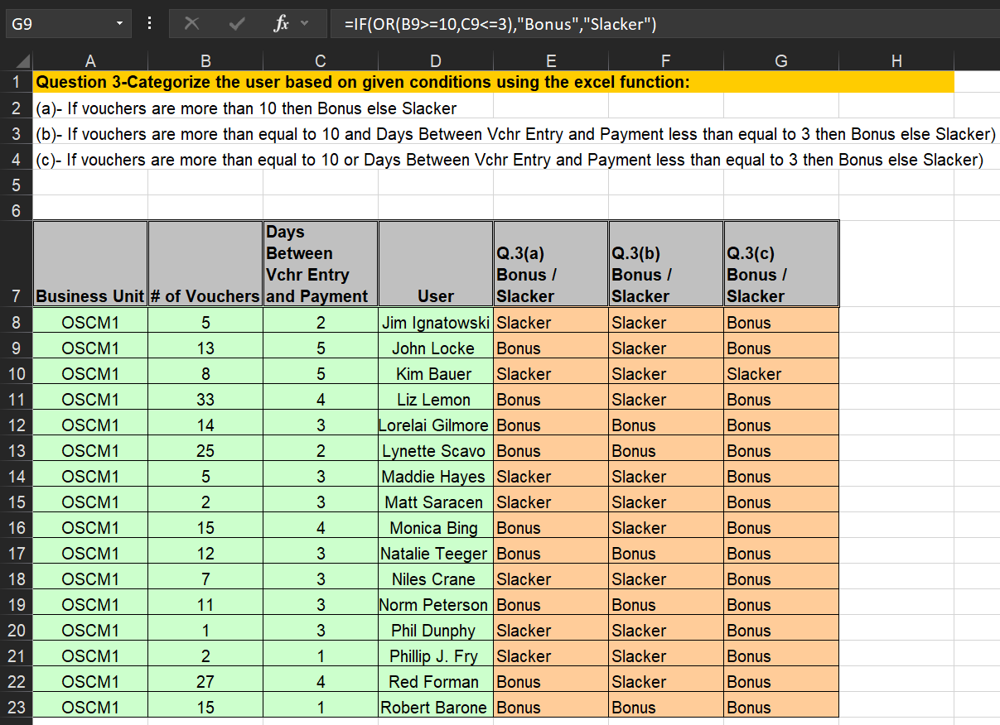

# **Categorizing Voucher Performance Using Conditional Operator**

## **Overview**
This project demonstrates advanced data analysis skills using MS Excel to categorize users based on the number of vouchers and the days between voucher entry and payment. By leveraging Excel functions, users are classified into two categories: "Bonus" or "Slacker" based on specific conditions. The project highlights essential Excel expertise, valuable for roles requiring data-driven decision-making.

---

## **Key Features**
- **Conditional Categorization**: Classify users based on voucher count and processing days.
- **Data Aggregation**: Summarize user performance effectively.
- **Insightful Visuals**: Clear tabular representation of categorization for better understanding.

---

## **Core Excel Functions Used**
1. **IF**
   - Executes conditional logic to categorize data.
   - Example: `=IF(B8 > 10, "Bonus", "Slacker")`

2. **AND**
   - Combines multiple conditions to produce a result.
   - Example: `=IF(AND(B8 >= 10, C8 <= 3), "Bonus", "Slacker")`

3. **OR**
   - Checks if at least one of multiple conditions is true.
   - Example: `=IF(OR(B8 >= 10, C8 <= 3), "Bonus", "Slacker")`

---

## **How the Formulas Work**
- **Q3(a) - Bonus / Slacker**: `=IF(B8 > 10, "Bonus", "Slacker")`
  - Condition: If the number of vouchers is more than 10, categorize as "Bonus"; otherwise, categorize as "Slacker".

- **Q3(b) - Bonus / Slacker**: `=IF(AND(B8 >= 10, C8 <= 3), "Bonus", "Slacker")`
  - Condition: If the number of vouchers is at least 10 and days between voucher entry and payment are 3 or less, categorize as "Bonus"; otherwise, categorize as "Slacker".

- **Q3(c) - Bonus / Slacker**: `=IF(OR(B8 >= 10, C8 <= 3), "Bonus", "Slacker")`
  - Condition: If the number of vouchers is at least 10 or days between voucher entry and payment are 3 or less, categorize as "Bonus"; otherwise, categorize as "Slacker".

---

## **Insights Derived**
- **Performance Classification**: Users are categorized based on voucher handling efficiency.
- **Error Handling**: Ensures accurate categorization with logical conditions.
- **Comprehensive Summaries**: Clear visualization of user performance metrics.

---

## **Why This Project Matters**
This project highlights critical Excel capabilities:
1. **Efficiency**: Quickly categorize and analyze user performance using formulas without manual intervention.
2. **Scalability**: Easily apply these methods to large datasets.
3. **Clarity**: Deliver summarized, actionable data for decision-making.

---

## **Conclusion**
This project underscores the power of Excel in analyzing structured datasets. By applying formulas like `IF`, `AND`, and `OR`, complex categorizations were performed with precision. It demonstrates strong data handling and analysis capabilities, making it an excellent portfolio addition for aspiring data analysts.
