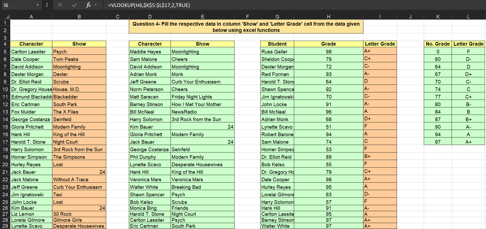

# **Populating Columns Using Lookup Functions**

## **Overview**
This project demonstrates advanced data analysis skills using MS Excel to populate the 'Show' and 'Letter Grade' columns based on given data. By leveraging the powerful VLOOKUP function, the project automates the process of matching character names to their respective shows and numerical grades to their corresponding letter grades. This showcases essential Excel expertise, valuable for roles requiring data-driven decision-making.

---

## **Key Features**
- **Automated Matching**: Use VLOOKUP to match and populate data automatically.
- **Data Aggregation**: Summarize show and grade data effectively.
- **Efficient Data Handling**: Ensure data consistency and accuracy through formula application.

---

## **Core Excel Functions Used**
1. **VLOOKUP**
   - Searches for a value in the first column of a range and returns a value in the same row from another column.
   - Example: `=VLOOKUP(A5, $D$5:$E$52, 2, FALSE)`
   - Example: `=VLOOKUP(H5, $K$5:$L$17, 2, TRUE)`

---

## **How the Formulas Work**
- **Populating 'Show' Column**:
  - **Formula in Cell B5**: `=VLOOKUP(A5, $D$5:$E$52, 2, FALSE)`
  - This formula searches for the character name in Column A within the range D5:E52 and returns the corresponding show name from the second column of the range. The FALSE parameter ensures an exact match.

- **Populating 'Letter Grade' Column**:
  - **Formula in Cell L5**: `=VLOOKUP(H5, $K$5:$L$17, 2, TRUE)`
  - This formula searches for the numerical grade in Column H within the range K5:L17 and returns the corresponding letter grade from the second column of the range. The TRUE parameter allows for an approximate match, which is useful for grade ranges.

---

## **Insights Derived**
- **Character and Show Matching**: Automated matching of characters to their respective shows.
- **Grade Conversion**: Efficient conversion of numerical grades to letter grades.
- **Comprehensive Summaries**: Clear visualization of data relationships between characters, shows, and grades.

---

## **Why This Project Matters**
This project highlights critical Excel capabilities:
1. **Efficiency**: Quickly and accurately populate columns using formulas without manual intervention.
2. **Scalability**: Easily apply these methods to large datasets.
3. **Clarity**: Deliver summarized, actionable data for decision-making.

---

## **Conclusion**
This project underscores the power of Excel in analyzing structured datasets. By applying the VLOOKUP function with both exact and approximate matches, complex data population tasks were performed with precision. It demonstrates strong data handling and analysis capabilities, making it an excellent portfolio addition for aspiring data analysts.
