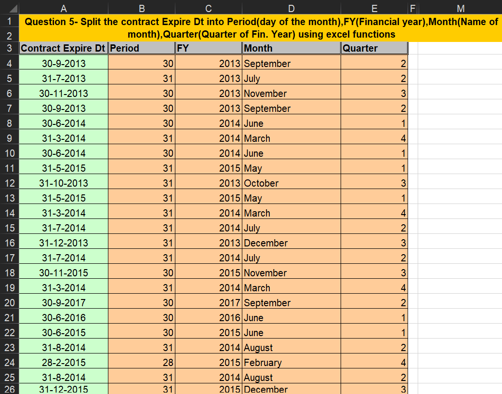

# **Analyzing Contract Expiry Dates By Splitting Cell Data**

## **Overview**
This project demonstrates advanced data analysis skills using MS Excel to extract and categorize specific components of contract expiry dates. By leveraging functions like DAY, YEAR, TEXT, and IF, the project automates the process of breaking down dates into periods, financial years, months, and quarters. This showcases essential Excel expertise, valuable for roles requiring data-driven decision-making.

---

## **Key Features**
- **Date Component Extraction**: Extract and categorize specific date components.
- **Data Aggregation**: Summarize contract expiry dates effectively.
- **Efficient Data Handling**: Ensure data consistency and accuracy through formula application.

---

## **Core Excel Functions Used**
1. **DAY**
   - Extracts the day of the month from a date.
   - Example: `=DAY(A4)`

2. **YEAR**
   - Extracts the year from a date.
   - Example: `=YEAR(A4)`

3. **TEXT**
   - Converts a date to a specific text format (e.g., full month name).
   - Example: `=TEXT(A4, "MMMM")`

4. **IF**
   - Executes conditional logic to determine the quarter of the year.
   - Example: `=IF(ROUNDUP(MONTH(A4)/3,0)-1=0,4,ROUNDUP(MONTH(A4)/3,0)-1)`

---

## **How the Formulas Work**
- **Period Column (B4)**:
  - **Formula**: `=DAY(A4)`
  - Extracts the day of the month from the contract expiry date in cell A4.

- **FY (Financial Year) Column (C4)**:
  - **Formula**: `=YEAR(A4)`
  - Extracts the year from the contract expiry date in cell A4.

- **Month Column (D4)**:
  - **Formula**: `=TEXT(A4, "MMMM")`
  - Converts the contract expiry date in cell A4 to the full month name.

- **Quarter Column (E4)**:
  - **Formula**: `=IF(ROUNDUP(MONTH(A4)/3,0)-1=0,4,ROUNDUP(MONTH(A4)/3,0)-1)`
  - Calculates the financial quarter of the year for the contract expiry date in cell A4. The formula divides the month number by 3, rounds up to the nearest whole number, and adjusts the result to fit the financial year quarters.

---

## **Insights Derived**
- **Date Breakdown**: Automated extraction of day, month, year, and quarter from contract expiry dates.
- **Categorization**: Efficiently categorized dates into meaningful financial periods.
- **Comprehensive Summaries**: Clear visualization of contract expiry data components.

---

## **Why This Project Matters**
This project highlights critical Excel capabilities:
1. **Efficiency**: Quickly and accurately extract date components using formulas without manual intervention.
2. **Scalability**: Easily apply these methods to large datasets.
3. **Clarity**: Deliver summarized, actionable data for decision-making.

---

## **Conclusion**
This project underscores the power of Excel in analyzing structured datasets. By applying formulas like `DAY`, `YEAR`, `TEXT`, and `IF`, complex date extraction tasks were performed with precision. It demonstrates strong data handling and analysis capabilities, making it an excellent portfolio addition for aspiring data analysts.

