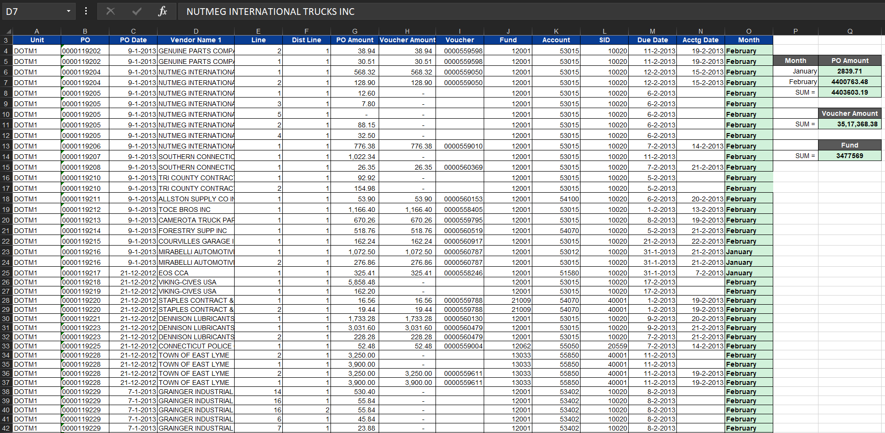
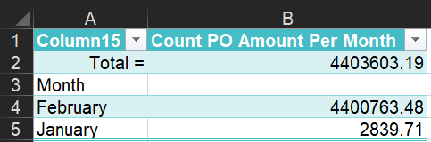
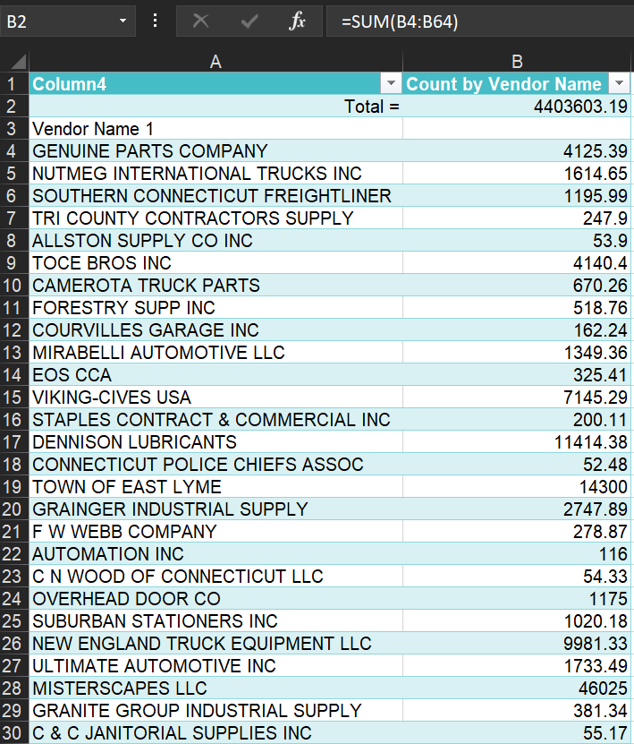
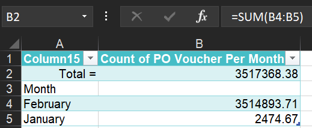
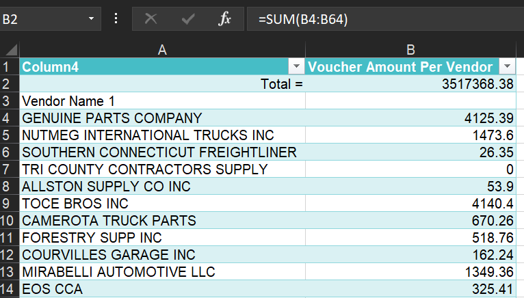
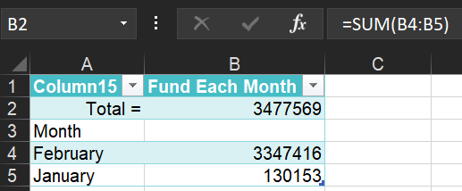
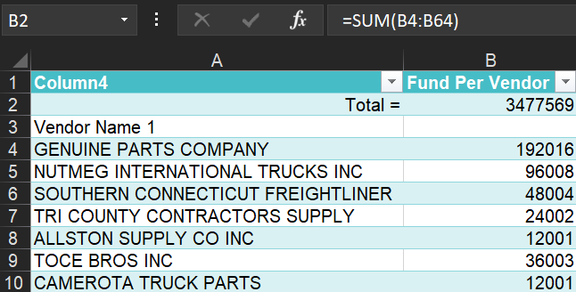

# **Comprehensive Financial Analysis Using Excel Formulas and Power Query**

## **Overview**
This project showcases advanced data analysis skills using MS Excel to analyze various financial metrics, including purchase orders, voucher amounts, and funds. By leveraging Excel formulas and Power Query, meaningful insights were derived through data grouping, aggregation, and visualization. The project demonstrates essential Excel expertise, valuable for roles requiring data-driven decision-making.

---

## **Key Features**
- **Date and Text Functions**: Extract and format date components.
- **Data Aggregation**: Summarize financial data effectively.
- **Power Query**: Group data by month and vendor for enhanced analysis.
- **Visualization**: Create charts for clear data representation.

---

## **Core Excel Functions Used**
1. **TEXT**
   - Converts a date to a specific text format (e.g., month name).
   - Example: `=TEXT(M4, "mmmm")`

2. **SUMIF**
   - Sums values based on a single criterion.
   - Example: `=SUMIF(O4:O251, P6, G4:G251)`

3. **SUM**
   - Adds up a range of cells.
   - Example: `=SUM(H4:H251)`, `=SUM(J4:J251)`

4. **Power Query**
   - Used to group data by month and vendor for better aggregation and analysis.

---

## **How the Formulas and Power Query Work**

### Main Sheet - Dataset

- **Month Column (O4)**: `=TEXT(M4, "mmmm")`  
  Converts the date in cell M4 to the full month name.
- **PO Amount Column (Q6)**: `=SUMIF(O4:O251, P6, G4:G251)`  
  Sums the purchase order amounts in G4:G251 where the month matches the value in P6.
- **Voucher Amount Column (Q11)**: `=SUM(H4:H251)`  
  Sums the voucher amounts in H4:H251.
- **Fund Column (Q14)**: `=SUM(J4:J251)`  
  Sums the fund amounts in J4:J251.

### Month Wise PO Amount 

- **Grouping by Month using Power Query**  
  Grouped the data by month to aggregate the purchase order amounts.
- **Total PO Amount (B2)**: `=SUM(B4:B5)`  
  Sums the purchase order amounts for each grouped month.

### Vendor Wise PO Amount 

- **Grouping by Vendor using Power Query**  
  Grouped the data by vendor to aggregate the purchase order amounts.
- **Total PO Amount (B2)**: `=SUM(B4:B64)`  
  Sums the purchase order amounts for each grouped vendor.

### Month Wise Voucher Amount

- **Grouping by Month using Power Query**  
  Grouped the data by month to aggregate the voucher amounts.
- **Total Voucher Amount (B2)**: `=SUM(B4:B5)`  
  Sums the voucher amounts for each grouped month.

### Vendor Wise Voucher Amount

- **Grouping by Vendor using Power Query**  
  Grouped the data by vendor to aggregate the voucher amounts.
- **Total Voucher Amount (B2)**: `=SUM(B4:B64)`  
  Sums the voucher amounts for each grouped vendor.

### Monthly Fund 

- **Grouping by Month using Power Query**  
  Grouped the data by month to aggregate the fund amounts.
- **Total Fund (B2)**: `=SUM(B4:B5)`  
  Sums the fund amounts for each grouped month.

### Vendor Wise Fund 

- **Grouping by Vendor using Power Query**  
  Grouped the data by vendor to aggregate the fund amounts.
- **Total Fund (B2)**: `=SUM(B4:B64)`  
  Sums the fund amounts for each grouped vendor.

---

## **Insights Derived**
- **Monthly and Vendor Trends**: Automated grouping and aggregation of financial data by month and vendor.
- **Data Aggregation**: Summarized purchase orders, voucher amounts, and funds efficiently.
- **Comprehensive Summaries**: Clear visualization of data trends through grouped data.

---

## **Why This Project Matters**
This project highlights critical Excel capabilities:
1. **Efficiency**: Quickly and accurately summarize and visualize data using formulas and Power Query.
2. **Scalability**: Easily apply these methods to large datasets.
3. **Clarity**: Deliver summarized, actionable data for decision-making.

---

## **Conclusion**
This project underscores the power of Excel in analyzing structured datasets. By applying formulas like `TEXT`, `SUMIF`, and `SUM`, alongside Power Query for grouping, complex data analysis tasks were performed with precision. It demonstrates strong data handling and analysis capabilities, making it an excellent portfolio addition for aspiring data analysts.

