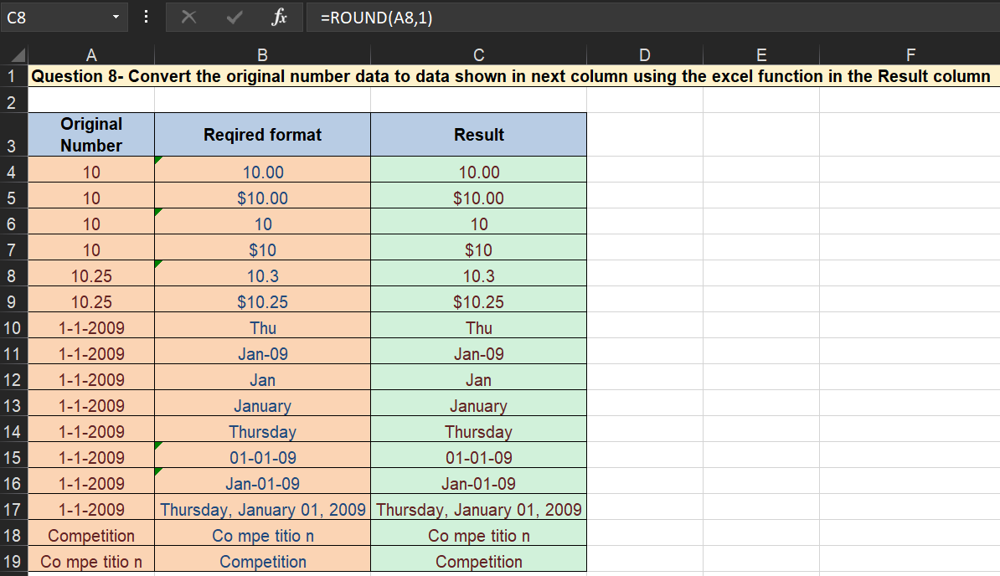

# **Advanced Data Formatting Techniques Using Excel**

## **Overview**
This project demonstrates advanced data formatting skills using MS Excel. The focus is on converting and formatting data in the 'Result' column based on the 'Original Number' and 'Required format' columns. By leveraging various Excel functions, the project highlights essential Excel expertise, valuable for roles requiring precise data presentation and manipulation.

---

## **Key Features**
- **Data Type Conversion**: Transform and format data using Excel formulas.
- **Efficient Data Handling**: Ensure data accuracy through formula application.
- **Versatile Formatting**: Apply various formatting techniques to meet specific requirements.

---

## **Core Excel Functions Used**
1. **ROUND**
   - Rounds a number to a specified number of digits.
   - Example: `=ROUND(A8,1)`

2. **TEXT**
   - Converts a value to text in a specific number format.
   - Examples:
     - `=TEXT(A10,"ddd")`
     - `=TEXT(A12,"mmm")`
     - `=TEXT(A13,"mmmm")`
     - `=TEXT(A14,"dddd")`

3. **LEFT, MID, RIGHT**
   - Extracts specific parts of a text string.
   - Examples:
     - `=LEFT(A18,2)&" "&MID(A18,3,3)&" "&MID(A18,6,5)&" "&RIGHT(A18,1)`
     - `=LEFT(A19,2)&""&MID(A19,4,3)&""&MID(A19,8,5)&""&RIGHT(A19,1)`

---

## **How the Formulas Work**

- **Cell C8**: `=ROUND(A8,1)`
  - Rounds the value in cell A8 to one decimal place.

- **Cell C10**: `=TEXT(A10,"ddd")`
  - Converts the date in cell A10 to the abbreviated day of the week (e.g., Mon).

- **Cell C12**: `=TEXT(A12,"mmm")`
  - Converts the date in cell A12 to the abbreviated month name (e.g., Jan).

- **Cell C13**: `=TEXT(A13,"mmmm")`
  - Converts the date in cell A13 to the full month name (e.g., January).

- **Cell C14**: `=TEXT(A14,"dddd")`
  - Converts the date in cell A14 to the full day of the week (e.g., Monday).

- **Cell C18**: `=LEFT(A18,2)&" "&MID(A18,3,3)&" "&MID(A18,6,5)&" "&RIGHT(A18,1)`
  - Extracts and rearranges parts of the text in cell A18 with spaces.

- **Cell C19**: `=LEFT(A19,2)&""&MID(A19,4,3)&""&MID(A19,8,5)&""&RIGHT(A19,1)`
  - Extracts and concatenates parts of the text in cell A19 without spaces.

---

## **Insights Derived**
- **Data Transformation**: Efficient conversion of numerical and textual data into desired formats.
- **Date Formatting**: Various ways to represent dates, including days and months.
- **Text Manipulation**: Techniques to extract and rearrange parts of text strings.

---

## **Why This Project Matters**
This project highlights critical Excel capabilities:
1. **Precision**: Accurately format data to meet specific requirements using formulas.
2. **Flexibility**: Apply a variety of formatting techniques to handle diverse data types.
3. **Efficiency**: Streamline data presentation and manipulation tasks.

---

## **Conclusion**
This project underscores the power of Excel in transforming and formatting data. By applying formulas like `ROUND`, `TEXT`, `LEFT`, `MID`, and `RIGHT`, complex data formatting tasks were performed with precision. 

