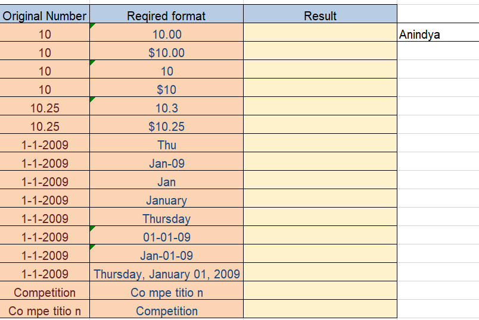
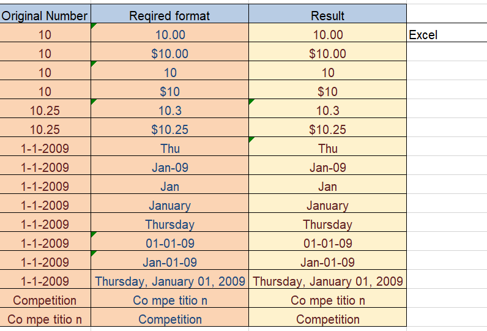

# **Automating Data Conversion and Replacement with Excel Macros**

## **Overview**
This project demonstrates the automation of data conversion and value replacement using Excel macros. Two macros have been created: one for converting data types in the 'Result' column based on the 'Original Number' and 'Required format' columns, and another for replacing a specific value in a cell. The project showcases essential Excel VBA skills, valuable for roles requiring efficient data manipulation and automation.

---

## **Key Features**
- **Macro for Data Conversion**: Automatically convert values in the 'Original Number' column to the 'Required Format' in the 'Result' column.
- **Macro for Value Replacement**: Replace a specific value in a cell and select another cell.
- **Efficient Data Handling**: Ensure data consistency and accuracy through automation.

---

## **Macros Used**
1. **Macro_Convert_Datatype** (Shortcut: `Ctrl + Shift + A`)
   - Converts all values in the 'Original Number' column to the 'Required Format' in the 'Result' column.

2. **Macro_Replace_Excel** (Shortcut: `Ctrl + Shift + B`)
   - Replaces any value (e.g., 'Anindya') in cell D4 with 'Excel' and then selects cell D5.

---

## **How the Macros Work**

### Before Applying Macros

### After Applying Macros

- **Cell C8**: `=ROUND(A8,1)`
  - Rounds the value in cell A8 to one decimal place.

- **Cell C10**: `=TEXT(A10,"ddd")`
  - Converts the date in cell A10 to the abbreviated day of the week (e.g., Mon).

- **Cell C12**: `=TEXT(A12,"mmm")`
  - Converts the date in cell A12 to the abbreviated month name (e.g., Jan).

- **Cell C13**: `=TEXT(A13,"mmmm")`
  - Converts the date in cell A13 to the full month name (e.g., January).

- **Cell C14**: `=TEXT(A14,"dddd")`
  - Converts the date in cell A14 to the full day of the week (e.g., Monday).

- **Cell C18**: `=LEFT(A18,2)&" "&MID(A18,3,3)&" "&MID(A18,6,5)&" "&RIGHT(A18,1)`
  - Extracts and rearranges parts of the text in cell A18 with spaces.

- **Cell C19**: `=LEFT(A19,2)&""&MID(A19,4,3)&""&MID(A19,8,5)&""&RIGHT(A19,1)`
  - Extracts and concatenates parts of the text in cell A19 without spaces.

---

## **Insights Derived**
- **Data Transformation**: Efficient conversion of numerical and textual data into desired formats.
- **Efficient Automation**: Save time and reduce errors through macro-based automation.
- **Text and Date Formatting**: Versatile techniques to represent and manipulate text and dates.

---

## **Why This Project Matters**
This project highlights critical Excel VBA capabilities:
1. **Automation**: Streamline repetitive tasks with macros.
2. **Precision**: Accurately convert and format data using VBA.
3. **Efficiency**: Enhance productivity through automation and reduce manual errors.

---

## **Conclusion**
This project underscores the power of Excel macros in automating data conversion and value replacement tasks. By applying VBA, complex data manipulation tasks were performed with precision, showcasing strong automation and data handling capabilities. This project is an excellent portfolio addition for aspiring data analysts and VBA developers.

