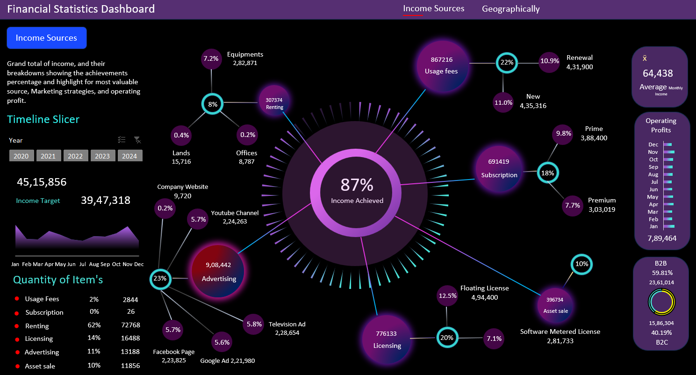
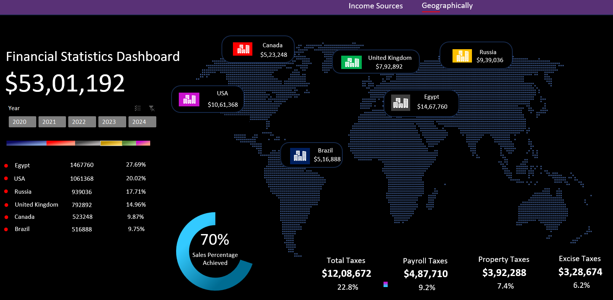

# Comprehensive Financial Analytics Dashboard: Unlocking Revenue and Geographic Insights

---

## Overview  
This project delivers a **Financial Analytics Dashboard** designed to visualize critical business metrics such as income, profitability, taxation, and geographic revenue contributions. The dashboard enables decision-makers to derive actionable insights with a focus on revenue achievements, tax distributions, and global financial performance.  

---

## Objective  
To create an intuitive and dynamic dashboard that provides a holistic view of financial data, enabling stakeholders to:  
1. Track revenue achievements and identify income sources.  
2. Analyze geographic income contributions for strategic planning.  
3. Understand tax components and their impact on profitability.  

---

## Key Features  
- **Dynamic and Interactive Visuals**:  
   - Slicers for filtering financial data by year (2020–2024).  
   - Geographic mapping for income contributions by country.  
- **Comprehensive Financial Metrics**:  
   - Revenue achieved vs. target.  
   - Breakdown of income sources and tax components.  
- **User-Friendly Design**:  
   - Clear and organized layout with engaging charts and data cards for quick insights.  
   - High-contrast visuals for enhanced readability.

---

## Dashboard Overview  

### Visuals Included:  
- **Donut Chart**: Visualizes revenue achievements with an **87% target success rate**.  
- **World Map**: Highlights income contributions across countries, showcasing key contributors like Egypt and the USA.  
- **Data Cards**: Display key financial metrics:  
  - Total Revenue: $53,01,192  
  - Total Taxes: $12,08,672 (22.8%)  
  - Operating Profit: ₹7,89,464  
  - Income Target: ₹39,47,318  
- **Tax Breakdown**: Detailed tax types (e.g., property, payroll, and excise taxes) represented as both values and percentages.  
- **Timeline Slicer**: Interactive year-wise filtering of financial data.  

### Dynamic Filters:  
The dashboard includes:  
1. **Timeline Slicers** for filtering data by years (2020–2024).  
2. **Income Sources and Geography Filters** to customize data exploration.  

### Dashboard Images:  
  
  

---

## Key Insights  
1. **Revenue Achievement**:  
   - Total income of ₹45,15,856 surpasses the target income of ₹39,47,318, achieving **87% of the target**.  
   - Egypt contributes the highest income of $14,67,760 (27.69%), followed by the USA at $10,61,368 (20.02%).  

2. **Geographic Analysis**:  
   - Major income contributors are concentrated in **Egypt, USA, and Russia**, collectively driving over 50% of total revenue.  
   - The geographic spread highlights potential for increased revenue in underperforming regions like Canada and Brazil.  

3. **Taxation Breakdown**:  
   - Taxes form a significant chunk of expenses, with **property and excise taxes collectively contributing 13.6%**.  
   - Payroll taxes make up the largest tax component at **9.2%**.  

4. **Profitability**:  
   - An operating profit of ₹7,89,464 indicates efficient cost management.  

---

## Recommendations  
1. **Enhance Revenue in Untapped Regions**:  
   - Focus on marketing and business development in **Canada and Brazil**, which show lower income contributions.  
2. **Optimize Tax Efficiency**:  
   - Explore strategies to reduce **property and excise taxes** without affecting operational performance.  
3. **Sustain Income Growth**:  
   - Maintain growth momentum in high-performing regions like **Egypt and the USA** through targeted strategies and consistent engagement.

---

## Conclusion  
This **Financial Analytics Dashboard** provides a clear and comprehensive view of financial performance, enabling strategic decisions. The insights derived from revenue achievement, geographic contributions, and tax distribution highlight growth opportunities and optimization areas.

---

## Final Note  
This project demonstrates the power of dynamic dashboards in making data-driven financial decisions. With its intuitive design and actionable insights, it serves as a robust tool for businesses aiming to monitor, analyze, and improve financial outcomes.  
