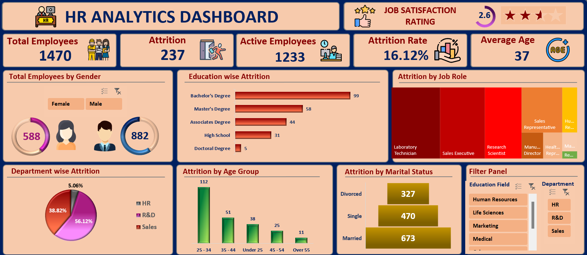

# HR Analytics Dashboard: Unlocking Workforce Insights  

## Overview  
This **HR Analytics Dashboard** provides a comprehensive overview of workforce data, helping organizations understand key trends, patterns, and issues related to employee attrition, demographics, and satisfaction. By presenting actionable insights in an interactive and visually appealing format, this project highlights the power of data analytics in optimizing human resource management.  

## Objective  
The primary goal of this dashboard is to identify critical factors driving employee attrition and provide data-driven recommendations to reduce turnover while improving employee satisfaction and retention strategies.  

## Key Features  
- **Interactive Design**: Equipped with dynamic filters for **Education Field** and **Department**, enabling tailored insights.  
- **High-Level Metrics**:  
  - Total Employees: **1,470**  
  - Attrition Rate: **16.12%**  
  - Active Employees: **1,233**  
  - Average Age: **37**  
  - Job Satisfaction Rating: **2.6/5**  
- **Visual Storytelling**: Clear and engaging visualizations for quick comprehension.  

## Dashboard Overview  
The dashboard is divided into several key sections:  

  

1. **Total Employees by Gender**:  
   - Female: **588**  
   - Male: **882**  

2. **Education-Wise Attrition**:  
   - Bachelor's degree holders exhibit the highest attrition with **99 employees** leaving.  

3. **Department-Wise Attrition**:  
   - Sales department accounts for the majority of attrition at **56.12%**, followed by R&D (**38.82%**) and HR (**5.06%**).  

4. **Attrition by Job Role**:  
   - Sales Executives and Research Scientists are the top contributors to attrition.  

5. **Attrition by Age Group**:  
   - Employees aged **25–34** have the highest attrition with **112 employees** leaving.  

6. **Attrition by Marital Status**:  
   - Married employees show the highest attrition (**673**), followed by Single (**470**) and Divorced (**327**).  

## Key Insights  
1. **High Attrition in Sales**:  
   - The **Sales department** has the highest attrition rate (**56.12%**), indicating the need for better engagement strategies or role-specific support.  

2. **Younger Employees Are Leaving**:  
   - Employees aged **25–34** have the highest turnover, suggesting a potential issue with job fit, career progression, or engagement.  

3. **Bachelor’s Degree Holders Are Most Affected**:  
   - Attrition is highest among employees with a **Bachelor’s degree**, warranting further analysis to address their needs and expectations.  

4. **Marital Status Influences Attrition**:  
   - Married employees contribute significantly to attrition (**673**), possibly due to work-life balance challenges.  

5. **Job Roles at Risk**:  
   - Key roles such as **Sales Executives** and **Research Scientists** experience high attrition, highlighting specific areas to focus on.  

## Conclusion  
This HR Analytics Dashboard delivers valuable insights into employee attrition trends and their underlying causes. By analyzing the metrics and visualizations, it becomes evident that addressing issues in the Sales department, providing support to younger employees, and enhancing job satisfaction across roles can significantly reduce turnover.  

## Recommendations  
1. **Targeted Retention Strategies**:  
   - Focus on addressing attrition in the Sales department through role-specific training and incentives.  

2. **Career Development Plans**:  
   - Create robust career growth opportunities for employees aged **25–34** to improve engagement.  

3. **Work-Life Balance Initiatives**:  
   - Introduce policies to support married employees, such as flexible working hours or childcare support.  

4. **Educational Support Programs**:  
   - Develop initiatives tailored to employees with Bachelor’s degrees to better align their career goals with organizational objectives.  

5. **Role-Specific Engagement**:  
   - Address challenges faced by Sales Executives and Research Scientists through improved onboarding and continuous feedback mechanisms.  

## Final Note  
This project demonstrates expertise in data visualization, storytelling, and HR analytics. It showcases the ability to derive actionable insights from complex datasets, making it highly relevant for HR professionals and organizations aiming to optimize their workforce strategies.  

---
**Pro Tip**: This dashboard can be further enhanced by incorporating predictive models to forecast future attrition trends and identify at-risk employees proactively.  
