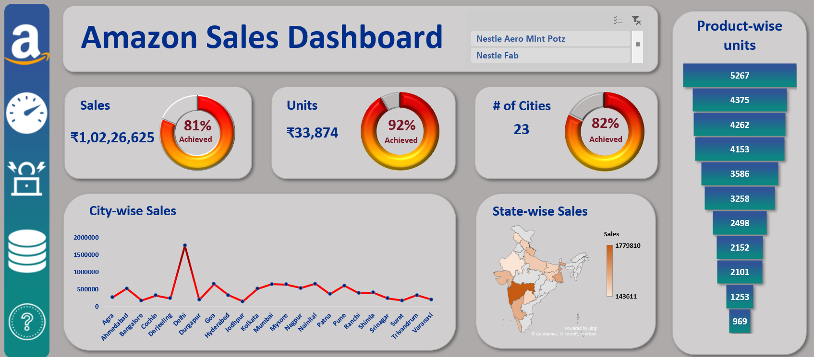

# **Amazon Sales Performance Dashboard 2022**  
### **Data-Driven Insights for Strategic Sales Growth**

## **Overview**  
The **Amazon Sales Performance Dashboard** offers a comprehensive analysis of sales across multiple dimensions, including city-wise, state-wise, and product-wise metrics. Designed to empower stakeholders with actionable insights, this dashboard highlights sales achievements, identifies regional growth opportunities, and provides data-driven recommendations to enhance sales strategies.  

---

## **Objective**  
This dashboard aims to **track and optimize Amazon's sales performance** by analyzing key metrics, identifying underperforming areas, and providing strategic recommendations to maximize sales and improve target achievement.  

---

## **Key Features**  
- **Dynamic Interactivity**: Includes slicers for tailored data analysis, enabling users to drill down into specific metrics.  
- **High-Level Metrics**:  
  - **Total Sales**: ₹1,02,26,625 (81% of target)  
  - **Units Sold**: 33,874 (92% of target)  
  - **Cities Covered**: 23 (82% of target)  
- **Data Visualizations**: Clear, compelling charts and heat maps that turn complex data into easy-to-understand visuals.

---

## **Dashboard Snapshot**  

### **Key Sections**  

1. **Sales Overview**:  
   - Total Sales: ₹1,02,26,625 (81% of target achieved).  
   - Units Sold: 33,874 (92% of target achieved).  

2. **City-Wise Sales**:  
   - **Top City**: Delhi leads, followed by Mumbai and Bangalore.  
   - Focus on scaling efforts in high-performing cities for growth.

3. **State-Wise Sales Distribution**:  
   - **Heat Map**: Sales distribution across states, with values ranging from ₹1,43,611 to ₹17,79,810, highlighting areas for expansion.  

4. **Product Performance**:  
   - **Top Product**: Highest-selling product with 5,267 units.  
   - Insights into customer preferences to optimize inventory and sales strategies.

---

## **Insights Derived**  

1. **Strong Sales in Key Cities**:  
   - Focus on **Delhi**, **Mumbai**, and **Bangalore** as primary growth drivers.  

2. **Opportunities in Underperforming Regions**:  
   - The heat map identifies underperforming states with opportunities for market penetration.  

3. **Effective Product Management**:  
   - By analyzing product-wise sales, strategies for managing inventory and promotions can be optimized.  

4. **Target Achievement Gaps**:  
   - Current sales are at **81% of the target**, indicating an opportunity to bridge the gap and achieve 100% of sales goals.

---

## **Conclusion**  
The **Amazon Sales Performance Dashboard 2022** provides a thorough analysis of Amazon’s sales performance across cities, states, and products. By focusing on **high-performing cities**, addressing **regional gaps**, and **optimizing the product mix**, Amazon can increase sales, meet targets, and drive profitability.

---

## **Strategic Recommendations**  

1. **Maximize Sales in Key Cities**:  
   - Prioritize marketing and distribution strategies in **Delhi**, **Bangalore**, and **Mumbai** to maximize sales.  

2. **Target Underperforming Regions**:  
   - Leverage insights from the heat map to improve sales in **underperforming states**.  

3. **Optimize Product Offering**:  
   - Reevaluate underperforming products and use targeted promotions to boost sales.  

4. **Focus on Achieving Sales Targets**:  
   - Implement strategies to close the **19% sales gap**, ensuring alignment with overall sales targets.

---

**Pro Tip**: Enhance this dashboard by integrating **predictive analytics** to forecast future sales and identify emerging trends.
